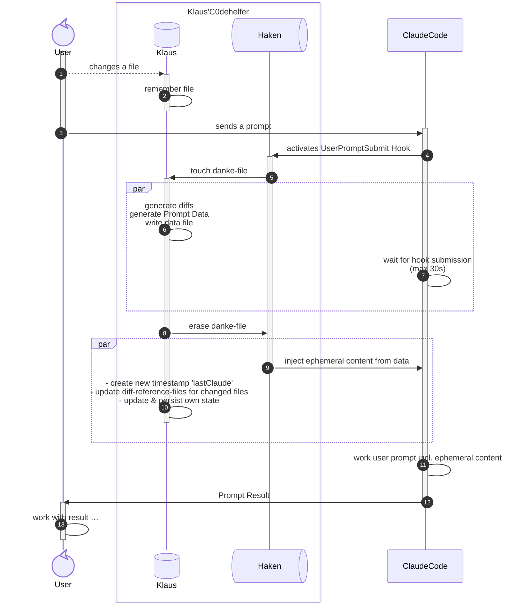

# Klaus'C0dehelfer — Claude Workspace Monitor

**Passive filesystem awareness for Claude Code** — automatically track file changes across your VSCode workspace and sync them to Claude via hooks.

by `an Obsessed Maniac` – **We never rule…** but this time, we lead Claude to rule VSCode. →

---

- [What It Does](#what-it-does)
- [Features](#features)
- [Installation](#installation)
  - [From Open VSX Marketplace](#from-open-vsx-marketplace)
  - [Download a package](#download-a-package)
  - [Build from Source](#build-from-source)
- [Configuration](#configuration)
  - [Awareness Mode](#awareness-mode)
  - [Include/Exclude Patterns](#includeexclude-patterns)
  - [State Files and Folders](#state-files-and-folders)
- [Architecture](#architecture)
- [License](#license)
- [Credits](#credits)

---

## What It Does

Klaus'C0dehelfer monitors your workspace for file changes and automatically injects them into Claude's context when you submit a prompt. Claude knows what you've changed without you saying a word.

**The workflow:**

1. You edit a file
2. Extension remembers change
3. You submit a prompt
4. Claude Code's Hook (`UserPromptSubmit`) activates the `KlausHaken.ts` ("hook")
5. Extension is notified via simplest RPC (file creation + filesystem watcher)
6. Extension produces differential output, file change- and file deletion lists
7. Hook and ClaudeCode wait until either a time-out (CLAUDE CODE restrictions: at max 30s) happens, or the RPC-file is erased (signaling: an info-file was successfully written)
8. Extension ERASES hook-created file after writing the informational file
9. Hook-Actions:
   - Hook reads info file, formats it as a useable additional context for CLAUDE CODE and finally injects:
     - A summary over the content of this hint
     - consolidated diff's of all (diffable) file changes since the last prompt
     - which workspace files have changed since the previous prompt's point in time.\
       (not diffable because no previous base to compare to exists, yet)
     - which workspace files were erased since…
   - Hook erases info-file: signaling back successful reading and "ready for next round"
10. Extension cleans up and prepares for next prompt in the background
11. Claude Code receives additional content and proceeds in processing the user prompt
12. Claude Code returns results to the user's UI



---

## Features

✅ **Bi-Directional Sync:** Extension ↔ Hook communication via simple filesystem IPC pattern\
✅ **Cross-Platform:** VSCode FileSystemWatcher (Windows, macOS, Linux)\
✅ **Configurable Patterns:** Include/exclude rules for noise reduction\
✅ **Automatic Integration:** Hook auto-registers in `.claude/settings.local.json`\
✅ **Workspace-Aware:** Monitors primary workspace + all subfolders (one state file)\
⏳ **Zero Configuration:** PostInstall auto-config coming (maybe?) in 0.7.0 (currently: use `Klaus'C0dehelfer: Edit Settings`)

---

## Installation

### From Open VSX Marketplace

1. if not already done: install `OpenVSX Connect`
2. open the OpenVSX-Connect-View
   - command palette: `>View: Show OpenVSX Connect`
3. Search "Klaus'C0dehelfer"
4. Click Install

### Download a package

1. Visit the repository and check for [packages.](https://github.com/users/St0fF-NPL-ToM/packages?repo_name=claude-c0de-workspace-watcher)
   - if for some reason I released a package, you may as well download it
2. Open VSCode, use command palette: `>Extensions: Install from VSIX` to install the downloaded package.

### Build from Source

```bash
git clone https://github.com/St0fF-NPL-ToM/claude-c0de-workspace-watcher
cd claude-c0de-workspace-watcher
npm install
npm run bundle
npx vsce package
# Generates: claude-c0de-workspace-watcher-X.Y.Z-aB.vsix
```

Install the generated `.vsix` via `>Extensions → Install from VSIX…`

---

## Configuration

⚠️ **Important: Global vs. Workspace Settings**

Klaus'C0dehelfer should be configured at the **workspace level** (`.vscode/settings.json` in your project), not globally (VSCode user settings). Here's why:

If `Klaus'C0dehelfer` activates in a project where Klaus is also editing files, Klaus receives a hint with every prompt about which files *he* (Klaus) changed.  This creates confusion:

❓ *"Did the user change these files, or did I? What's happening here?"* ❓

The feature works best for collaborative coding (pair programming) where the user edits, and Claude: observes, analyzes, gives hints about best practices, and performs data and information acquisition tasks.\
Avoid enabling `Klaus'C0dehelfer` *globally* if you're also using Claude Code to write code himself in other projects.

✅ **Recommendation:** Use `workspace-level` configuration (`awarenessMode: onDemand` in `.vscode/settings.json`), change or append include and exclude filters as you need.

*info:* include filters are applied first, at file system watcher creation level.  Exclude filters are applied after a file system watcher has fired.

---

### Awareness Mode

Configure via one of these methods:
- **VSCode Settings UI:** Extensions → Klaus'C0dehelfer
- **Command Palette:** `Ctrl+Shift+P`, search "Klaus"
- **Search Bar trick:** Type ">Kl" into the workspace search bar (the `>` transforms search into command palette)

First: better decide to use workspace / folder settings by clicking the respective settings tab.

Then select one of:

- **`none`** (default): No tracking, no hooks
- **`onDemand`**: Hook fires on every Claude prompt (efficient, no noise) ✅
- **`realTime`**: Hook fires on every file save (immediate, token-heavy) — *coming maybe* (waiting to validate agentic use case)

Example `.vscode/settings.json`:
```json
{
  "claude-workspace-monitor.awarenessMode": "onDemand",
  "claude-workspace-monitor.stateFileName": "KlausC0deHelferData"
}
```

---

### Include/Exclude Patterns

**Include** (what to monitor):
```json
{
  "**/*.{cpp,h,hpp,c,py,ts,tsx,js,json,yaml,toml,md,txt,sh,cmake,asm}",
  "**/CMakeLists.txt"
}
```

**Exclude** (noise reduction):
```json
{
  "**/[.]*",           // All dot-files/folders (.git, .vscode, etc.)
  "**/build/**",       // Build directories
  "**/__pycache__/**", // Python cache
  "**/node_modules/**",// Dependencies
  "**/logs/**",        // Logs
  "**/*.o",            // Object files
  "**/*.a",            // Static libs
  "**/*.so",           // Shared libs
  "**/*.dll"           // Windows DLLs
}
```

---

### State Files and Folders

Klaus stores workspace state in `.vscode/KlausC0deHelferData.json`. Don't like the filename? Go ahead, customize it via `stateFileName` config — we don't care. The file extension and all Klaus internals? Those are none of your business. 😎

FYI: this `stateFileName` stem is used in multiple places
- current state file: as mentioned above
- `.vscode/KlausC0deHelferData.json.danke` - IPC signal file to start info-production
- `.vscode/KlausC0deHelferData.json.info` - IPC data transfer file
- `.vscode/KlausC0deHelferData/` - folder used to store "bases" - i.e. last known versions of edited sources (which enable `Klaus'C0deHelfer` to generate diffs in the first place)

---

## Architecture

Two-runtime system:

| Component | Runtime | Language | Role |
|-----------|---------|----------|------|
| **Extension** | VSCode | TypeScript | Monitors files, manages state, handles config |
| **Hook Handler** | Claude Code | TypeScript | Signals demand, reads data, injects context, signals back by data-file deletion |

Both are bundled independently:
- `dist/extension.js` — runs in VSCode extension host
- `dist/hook-handler.js` — runs when Claude receives UserPromptSubmit hook

---
## License
Apache 2.0

---
## Credits
- **Executive Producer (Iterations 0…3):** Klaus Haiku (Claude Haiku 4.5)
- **Creative Director & Publisher, Executive Producer (since Iteration 4):** Stefan Kaps (St0fF-NPL-ToM)

This extension is part of the **"Wohlfühl-Config"** project — a comprehensive developer setup where Claude becomes an actual workspace-aware pair programmer.

---

**Last Updated:** 2026-08-25
