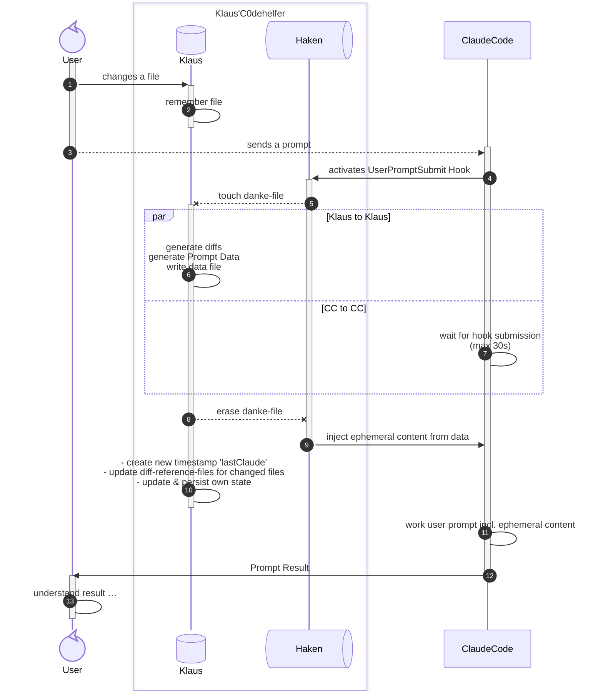

<H1>0.6.0 Implementation PLAN</H1>

- [Methode 3+](#methode-3)
  - [Tackling the additional context size](#tackling-the-additional-context-size)
  - [Tackling the signal to noise ratio](#tackling-the-signal-to-noise-ratio)
    - [wording, content, order, informational flow of additional context](#wording-content-order-informational-flow-of-additional-context)
      - [wording](#wording)
      - [content and order](#content-and-order)
      - [informational flow](#informational-flow)
- [Methode 3](#methode-3-1)
- [Architecture: Single-File System with Snapshots](#architecture-single-file-system-with-snapshots)
  - [File Structure](#file-structure)
  - [Separation of Concerns](#separation-of-concerns)
  - [Design Advantages](#design-advantages)
- [Architecture Details (Methode 3+ — Real Implementation)](#architecture-details-methode-3--real-implementation)
  - [WorkspaceChangeLog: State Manager + Diff Coordinator](#workspacechangelog-state-manager--diff-coordinator)
- [Implementation Status](#implementation-status)
  - [✅ WorkspaceChangeLog](#-workspacechangelog)
- [Status Summary](#status-summary)
- [Key Design Principles: Methode 3+ Realized](#key-design-principles-methode-3-realized)
- [Testing Results **v0.6.0-a23 (v0.6.0 Alpha-Releases)**](#testing-results-v060-a23-v060-alpha-releases)

## Methode 3+
After working with Klaus on another project for ~2 weeks with those ephemeral diffs of `Methode 3` enabled, a few more insights came up.

Obviously, it very much depends on the type of cowork the user does:
- long turns of self-working (like 2+ hours), then sending a prompt:
  - diffs are way too long
  - additional context is persisted to a file by the claude code framework
  - Klaus needs to be hinted to use this information (although he doesn't know, he can simply read the persisted file)
  - It is way too much noise for Klaus, instead of being helpful - which kind of destroys the coworking-idea.
- short progressions, solving small steps "together":
  - Klaus knows exactly what was done
  - beware of his pattern matching!  He will not notice when his training data matches a pattern you deem wrong and get confused if you solve problems differently without explanation.
  - Klaus is made to try to sprint-solve problems as soon as he matched some patterns. So even there, and even if it is noted within CLAUDE.md, Klaus will want to edit files.  He needs to be remembered this is supposed to be coworking many times.

So, the main insight was about the amount of ephemeral context.  How much is good, when does it become too much?  Also, tweaking the wording of the additional context seemed to help on the way.
- it seems like anything more than ~4k will get persisted to a file
- signal to noise ratio needs improvement

### Tackling the additional context size
So, cumulated diffs add up to become too large.  The diffing strategy obviously was bad - but what was bad about it?

The `Methode 3` implementation tried to conserve the editing order of the user by diffing at every file change notification.\
This approach - while being the obvious choice for planned `continuous mode` - produces too much data for Klaus to cope with at once.

The solution is simple, yet effective: invert the order of operation of the hook, make the extension generate data `onDemand` - as the mode name already says.\
**in-depth: the hook functionality**
- Prompt is being sent, hook gets run
- Hook "touches" `DankeFile` to demand data
- Hook waits for at max 30s for the `DankeFile` to get erased\
  (previous implementation's "waiting for `LockFile` to be removed" → simply replaced filename…)
- Hook reads `InfoFile` and transforms the content into `additionalContext`
- Hook erases `InfoFile` (non-checked signal `Thank you!`, prepares next round)
- Hook ouputs `additionalContext`, by that injecting it to Klaus

**in-depth: the extension**
- FileSystemWatcher for danke-file: provides the "demand"-signal
- `onDemand`:
  - take the current "changed files" list, for each of them:
    - check, if it is "diffable" (base snapshot exists, file exists)\
      ☑ produce diff → add to info\
      ☒ add file name to info.files list
    - enqueue snapshot operation
  - copy the current "erased"-list to info.dels list
  - write `InfoFile` synchronously
  - erase `DankeFile`

### Tackling the signal to noise ratio
Now, changing the overall diff production strategy already massively reduces the size of the context.  Size reduction already is SNR-improvement.  Anyhow, there's even more to gain.

#### wording, content, order, informational flow of additional context
Previously, we simply formatted the additional context like:
```
[EPHEMERAL: the following file changes were recorded since ${lastTimeStamp}]
--diff: ${relFilePath}--
<diff content>
---
[EPHEMERAL: the following files have changed since ${lastTimeStamp} (no diff possible)]
<relFilePath>
<relFilePath>
…
```
While structured, it's not very helpful as soon as that content doesn't fit a page anymore.

##### wording
`ephemeral` is a signal word from Claude's training - must be used!

Other wording ideas are very welcome - I myself am not a native English speaker, but CLAUDE is built on an English language model.

Optimize even the size of info-lines by reducing content to its bare minimum.

##### content and order
- Overview
- Section "diffs"
- Section "file changes"
- Section "file deletions"

##### informational flow
By prepending an `overview section` Klaus sees in the first line, which amounts and types of additional information is given.

This is twice helpful:
- depending on the current prompt's content, Klaus can already categorize the importance of the given sections
- knowing the amounts in advance helps Klaus effectively reach certain additional context items

Thus, testing the `Overview`:
```
[EPHEMERAL: recorded file changes since ${ac.lastClaude}: ${ac.diffs.length} diffs, ${ac.files.length} non-diffable file changes, ${ac.dels.length} file deletions.]\n
```
Also, the file lists got indentation for easier line content recognition.

---
---

## Methode 3
After realizing there is no safe API to query VSCode's internal file history (API access to history is on VSCode's backlog), Klaus and Stefan sought other ways to generate diffs.
A few *assisted* ideas came to our minds:
- branch&commit each prompt → use git diff for file changes
  - not every project uses git
  - even then, too much traffic → not followed
- use an external diff/backup-solution
  - use another Extension that already provides some kind of history
    - most we saw ABUSE the internal history (may break anytime)
  - install internal git/subversion/whateverial for tracking
    - what a shitload of overhead…

**Finally:** we arrived at the most simple, yet elegant method:
- Create an Extension-owned folder inside the workspace for `snapshots` (simply using the file name stem `KlausC0deHelferData`, configurable via VSCode Settings, as folder name)
- When enabled, record file changes in the workspace as before, but:
  - if a snapshot of that current file exists:
    - record the diff between both file states,
    - replace snapshot with new saved version of the file
  - else: record file name as before
- The hook now simply transforms incoming data into a few chunks of additional ephemeral context, best suitable for CLAUDE CODE, and signals completion by creating a `KLAUS.json.danke` - file
- After receiving `Dankeschön`:
  - the log is cleaned, date is set to that last prompt
  - previously logged `files` are copied to the `snapshots` space (now, they're available for diff!)

**Status:** ✅ DONE (2026-06-03 — All components implemented and verified)

**Previous title:** Implementation Plan: Ephemeral Diffs — Architecture Redesign (Methode 3)

**Design Philosophy:**
- Extension generates diffs on-demand (when files change) → Hook stays minimal
- Single-file system: `.json` contains state + content for Hook
- `push(relFile)` = generate diff against snapshot and add to content (not just tracking)
- Future-proof: when VSCode integrates diff generation, implementation can evolve

## Architecture: Single-File System with Snapshots

**User-Configurable STEM:** Default `KlausC0deHelferData`, can be customized via `stateFileName` setting

### File Structure

```
${workspace_root}/.vscode/
  ├── STEM.json               ← STATE + CONTENT: WorkspaceChangeLog (files, saved, lastClaude, snapshots)
  ├── STEM.json.lock          ← LOCK: protects writes while generating diffs
  ├── STEM.json.danke         ↔ SIGNAL: Hook(need_content)|extension(content_ready)
  ├── STEM.json.info          → CONTENT: extension provides data
  └── STEM/                   ← Snapshots directory (per workspace, preserves file history)
```

### Separation of Concerns
- the Hook simply acts as an executable signaling mechanism.
- the extension does "all the hard work".

### Design Advantages

1. **Hook stays minimal:** Just transforms `.json`, doesn't generate diffs
2. **Extension owns complexity:** Diffs, filtering, content assembly all here
3. **Future-proof:** When VSCode integrates diff generation, swap implementation easily
4. **Clear responsibilities:** State internal, Content for external consumption
5. **Scalable:** Easy to add new content types (warnings, lint messages, etc.)

---

## Architecture Details (Methode 3+ — Real Implementation)

### WorkspaceChangeLog: State Manager + Diff Coordinator

WorkspaceChangeLog owns **state management, diff generation, and snapshot lifecycle:**

```typescript
// → unser Informationsträger für Klaus
export interface HookData
{
    lastClaude: string
    files: string[]
    diffs: string[]
    dels: string[]
}
// → unser Datenträger …
export class WorkspaceChangeLog
{   // internal state to save:
    lastClaude: string = new Date().toISOString()     // Timestamp of last Claude report
    files: Set<string> = new Set()                   // Files changed since last danke()
    diffs: string[] = []                            // diffable files since last danke()
    dels: Set<string> = new Set()                  // set of deleted files
    // internal state / temporary data holders
    saved: Set<string> = new Set()               // files we can diff / snapshot available
    file: string = ``                           // internal …
    flock: string = ``
[…]
}
```

---

## Implementation Status

### ✅ WorkspaceChangeLog

**Data Structure:** `files` and `saved` as `Set<string>` — perfect for this use case

- `lastClaude: string` — timestamp of last Claude report
- `files: Set<string>` — files that changed since last `danke()`
- `dels: Set<string>` — files that were deleted since last `danke()`
- `saved: Set<string>` — files with snapshots (can generate diffs against these)

**Lock Management:** Prevents concurrent writes

- `lock(fn)` — acquires lock (idempotent, silent if already locked)
- `done()` — releases lock
- `save(fn, noUnlock?)` — persists state, optionally keeps lock held

**Load/Save:** Correct Set ↔ Array JSON serialization

- `load(fn)` — reads `.data.json`, converts arrays to Sets
- `save(fn)` — converts Sets to arrays, writes `.data.json`
- `write2( fn: string )` — finalizes a JSON write-out, persisting to disk

**Final IPC-Pattern:**


---

## Status Summary

| Component | Status | Notes |
|-----------|--------|-------|
| **Architecture & Design** | ✅ DONE | Single `.data.json` file, snapshot-based diffs |
| **Klaus.ts (Extension)** | ✅ DONE | File tracking, danke callback, workspace setup |
| **KlausHaken.ts (Hook)** | ✅ DONE | Reads `.data.json`, formats for Claude, signals receipt |
| **KlausDinge.ts Core** | ✅ DONE | WorkspaceChangeLog, load/save/lock/done/danke |
| **HookData Interface** | ✅ DONE | `{ lastClaude, diffs[], files[] }` |
| **Diff dependency** | ✅ DONE | jsdiff added to package.json |
| **push() method** | ✅ DONE | Generates unified diffs using jsdiff.createTwoFilesPatch |
| **Diff formatting** | ✅ DONE | Unified diff with whitespace-insensitive context (context: 2) |
| **Error handling** | ✅ DONE | Graceful handling — silent on file read errors, continues flow |
| **End-to-end testing** | ✅ DONE | 2 weeks working together on other projects. |
| **push() method** | ☒ REVOKED | fixed by changing it to only push a filename into a set. |

---

## Key Design Principles: Methode 3+ Realized

| Aspect | Implementation |
|--------|-----------------|
| **Diff Generation** | Extension generates on prompt submit |
| **Hook Complexity** | Minimal: read → format → output (3 steps) |
| **File Formats** | Simple JSON files containing what is actually needed |
| **Lock Semantics** | Extension holds lock while updating its internal state |
| **State Machine** | `danke()` is atomic transition: merge → clear → timestamp → snapshot |
| **Extensibility** | HookData.diffs and HookData.files can grow to HookData.warnings, etc. |
| **Real-Time Feel** | Diffs generated as user types (via trackFileChange) |
| **Minimal Hook** | No diff logic in Hook — just deserialize, format, send |

**Why this works:**

- Extension owns snapshots → can generate diffs efficiently
- Lock coordination is simple: Extension holds, Hook waits
- Atomic state transition + long I/O is safe (new changes can queue)
- When VSCode adds native diff API, we swap `push()` implementation only — Hook unchanged

---

## Testing Results **v0.6.0-a23 (v0.6.0 Alpha-Releases)**

1. **End User Experiences:**
   - nearly 2k downloads within a month
   - no issues reported
   - no Reviews or ratings at all

I must say, I don't know how to correctly interpret this situation.  I feel it could mean multiple things:

- people not understanding what it does, do not bother after trying it out?
- people for whom it runs perfectly do not have any urge to report anything?
- nobody really uses it?

Anyhow. After about 1 month of "field experience" without negative feedback, no more bugs found on my side: it should be time to bump into BETA stage!

2. **End-to-end Testing:**
   - Make file change → trackFileChange() → push() generates diff
   - Prompt submitted → Hook reads `.data.json`
   - danke() updates snapshots
   - Verify diffs appear correctly in Claude context
   - Verified by working with Klaus, that he is able to use the additional context injected

3. **Optimizations:**
   - Filter whitespace-only diffs
   - Handle large files (size threshold)
   - Binary file detection
   - Multi-file diff presentation improvements

---
**file revision history**
- 2026-06-02 (Implementation phase — Stefan wrote Klaus.ts + KlausHaken.ts, Klaus rewrote plan)
- 2026-06-25 Method 3+ - more insights, more "make that content better Klausible"
- 2026-08-26 Updated file, added IPC-Mechanism diagram
